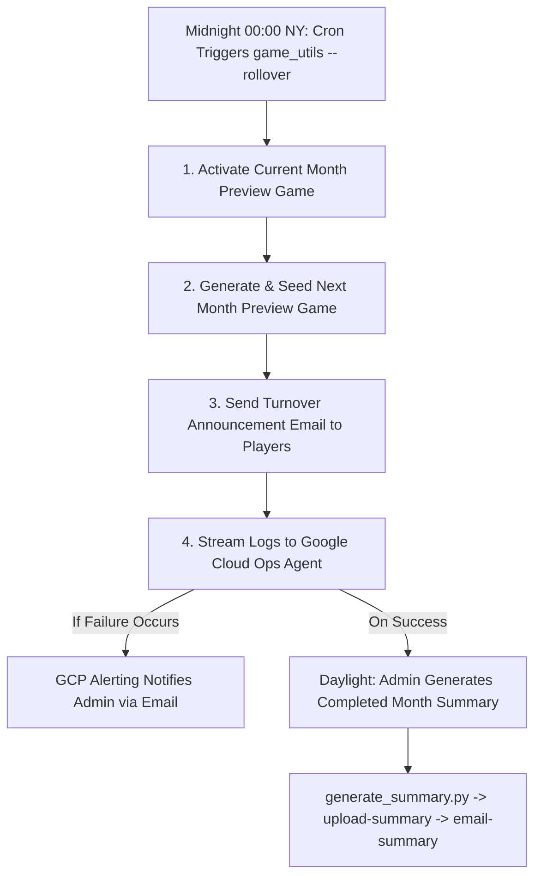

# Geodashing V2 - Game Rollover & Summary Generation Guide

This guide details the architecture and operational procedures for the monthly game rollover, automated turnover execution, and AI game summary generation.

## Rollover Lifecycle Model

Geodashing V2 operates on a continuous monthly lifecycle ensuring players can always preview upcoming dashpoints while active gameplay and log submissions remain strictly locked to the current calendar month.

### Transition Timeline (e.g. June 1st Transition)
1.  **Automated Turnover (00:00:00 America/New_York via Cron)**:
    *   **Promote Current Game**: Activates the existing June game (previously in preview mode) and retires the May game.
    *   **Seed Next Preview Game**: Generates ~35,000 dashpoints for July using pre-planned titles from `data/game_titles.json` and seeds it in preview mode (`is_active = FALSE`).
    *   **Player Announcement Email**: Dispatches a notification to the player mailing list announcing that June is live and July is available for preview.
    *   **Alerting**: Failures automatically trigger Google Cloud Error Reporting / Ops Agent alerting (email is never sent to players on failure).
2.  **Post-Turnover Editorial Summary (June 1st, Daylight Hours)**:
    *   **Synthesize Summary**: Administrator generates the AI summary for the completed May game using `generate_summary.py`.
    *   **Review & Publish**: Admin reviews/edits the HTML summary, validates and uploads it to the database with `game_utils.py --upload-summary`, and sends the final results email with `game_utils.py --email-summary`.

---

## Rollover Architecture Map



### Administrative Prerequisites
All commands on the production machine are executed inside the project's virtual environment (`.venv`) with configurations loaded from `backend/config.ini`.

```bash
# Navigate to the project root on production
cd /home/lucien/src/geodashing-v2

# Activate the virtual environment
source .venv/bin/activate
```

---

## Automated Turnover Execution

The production server runs the turnover command automatically at `00:00:00 America/New_York` on the 1st of every month via cron:
```cron
CRON_TZ=America/New_York
0 0 1 * * /home/lucien/src/geodashing-v2/.venv/bin/python -m backend.scripts.game_utils --rollover >> /var/log/geodashing/turnover.log 2>&1
```

### Manual Turnover Execution or Simulation
To manually trigger the turnover or test in dry-run mode:
```bash
# Dry run simulation (no database changes or emails sent)
python -m backend.scripts.game_utils --rollover --dry-run

# Live execution for current month
python -m backend.scripts.game_utils --rollover

# Target a specific month or dashpoint count
python -m backend.scripts.game_utils --rollover --year 2026 --month 8 --count 35000
```

In this walkthrough, we assume the date is **June 1st**. We are closing the **May game (ID 13)**, activating the **June game (ID 14)**, and seeding the **July game (ID 15)** as the new preview.

---

### Step 1: Compile & Publish the Completed Month's Summary

First thing on the 1st of the month, once all submissions for the previous month are officially closed and final, synthesize the AI summary of player logs.

#### 1. Run the AI Summary Generator
Extract all score rankings, spatial nearest-city context, and approved player photos/logs for the finished May game (ID 13) and save them to a temporary folder:

```bash
# Create a secure temporary directory inside the system temp folder
mkdir -p /tmp/summary_work

# Synthesize the raw summary files using the Gemini model
python -m backend.scripts.generate_summary --game_id 13 --output_dir /tmp/summary_work
```

#### 2. Review and Polish the Generated Output
Open `/tmp/summary_work/game_13_output.html` in a text editor. Review the formatting to ensure all player names, statistics, and image thumbnails render smoothly. You may make minor editorial adjustments directly in the HTML file as long as you do not violate the whitelisted HTML schema constraints (such as using forbidden layout/script tags).

#### 3. Validate and Upload the HTML Summary
Run the administrative validator to check the HTML fragment structure and upload it directly to the database:

```bash
python -m backend.scripts.game_utils \
  --upload-summary /tmp/summary_work/game_13_output.html \
  --game_id 13
```

> [!NOTE]
> If errors are reported by the validator, fix the tags in the HTML file and re-run the upload command.

#### 4. Email the Game Summary to the Player List
Once the summary is successfully saved in the database, dispatch it to the registered geodashing player mailing list specified in the `config.ini` file using:

```bash
python -m backend.scripts.game_utils \
  --email-summary \
  --game_id 13
```

This will format the email with the subject `"Geodashing Game 13 (May 2026) Results"`, construct both rich HTML and a clean, tag-stripped text fallback version, and securely send it via the Gmail REST API using the project's service account domain-wide delegation credentials.

---

### Step 2: Activate the Current Month's Game

Promote the preview game that has been prepared for the current month (June, ID 14) to active status.

#### 1. Perform the Rollover Command
Execute the `--activate` command to swap active states in a single database transaction. This marks all previous games as inactive and sets the new game to active:

```bash
# Activating the June Game (ID 14) and archiving the May Game (ID 13)
python -m backend.scripts.game_utils --activate 14
```

#### 2. Perform Sanity Checks
List the database games to confirm that the active status has correctly shifted:

```bash
python -m backend.scripts.game_utils --list
```

The output must show that the target game is now active:
```text
ID    | Active   | Start Time           | End Time             | Title
--------------------------------------------------------------------------------
12    | NO       | 2026-04-01 00:00:00  | 2026-04-30 23:59:59  | April 2026 Classic
13    | NO       | 2026-05-01 00:00:00  | 2026-05-31 23:59:59  | May 2026 Classic
14    | YES      | 2026-06-01 00:00:00  | 2026-06-30 23:59:59  | June 2026 Dashing Classic
```

---

### Step 3: Seed the Next Month's Game as a Preview

Immediately seed the upcoming month's game (July, ID 15) in a `preview` state. This makes upcoming July dashpoints visible to the community via the frontend for planning and geographical routing throughout June, but completely blocks players from logging visits until July 1st.

#### 1. Generate the Preview Game
Run the game generator using the `--preview` flag. Explicitly set the title, target year, and target month.

```bash
# Seeding Game 15 for July 2026 in inactive preview mode
python -m backend.scripts.generate_game \
  --title "July 2026 Dashing Classic" \
  --count 31000 \
  --year 2026 \
  --month 7 \
  --preview
```

#### 2. Verify Seeding in the Database
Verify that the new preview game has successfully registered in an inactive state:

```bash
python -m backend.scripts.game_utils --list
```

The output should resemble the following:
```text
ID    | Active   | Start Time           | End Time             | Title
--------------------------------------------------------------------------------
13    | NO       | 2026-05-01 00:00:00  | 2026-05-31 23:59:59  | May 2026 Classic
14    | YES      | 2026-06-01 00:00:00  | 2026-06-30 23:59:59  | June 2026 Dashing Classic
15    | NO       | 2026-07-01 00:00:00  | 2026-07-31 23:59:59  | July 2026 Dashing Classic
```

---

### Step 4: Verification & Workspace Cleanup

Once the rollover sequence is complete, perform a visual check of the system and clean up temporary files.

#### 1. Frontend Verification
Navigate to the web interface (e.g., `https://www.geodashing.org/`) and verify the following visual cues:
1.  **Current Active Game (June)**: The interactive map displays the June dashpoints and the Leaderboard displays standings initialized at 0 points.
2.  **Completed Game (May)**: Clicking the historical list in the header allows selecting the May game, which displays its final leaderboard standings and renders the "📖 READ GAME SUMMARY" modal loaded with your newly uploaded HTML summary.
3.  **Upcoming Preview Game (July)**: July points are visible as inactive preview pins or listed in the upcoming scheduler views if configured.

#### 2. Workspace Cleanup
Clean up the system temporary directory:

```bash
# Securely purge temporary summary files containing player data dumps
rm -rf /tmp/summary_work
```
